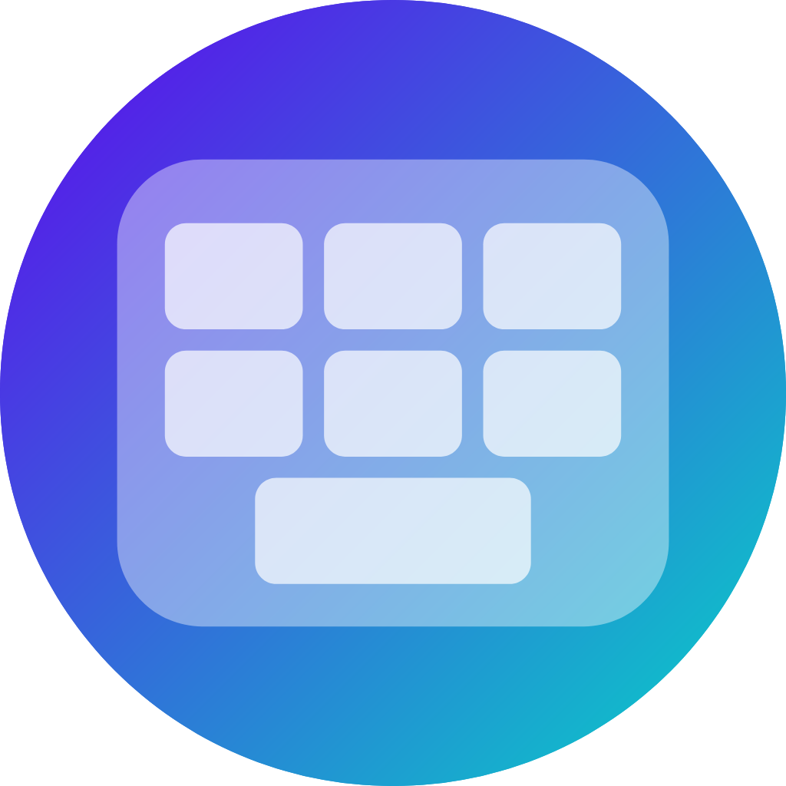

  
  <h1>BlurBoard</h1>

A fork of HeliBoard that uses the Android [Window Blur API](https://source.android.com/docs/core/display/window-blurs) for a blurred keyboard background. In addition, I have made my own adjustments to the defaults, which make the keyboard look a little more like Gboard by default. 

> [!WARNING]  
> Please note that the API is not available on all Android devices and the blur effect is not necessarily active even when supported (e.g., in power saving mode).

  

### HeliBoard Features
<ul>
  <li>Add dictionaries for suggestions and spell check</li>
  <ul>
    <li>build your own, or get them  <a href="https://codeberg.org/Helium314/aosp-dictionaries#dictionaries">here</a>, or in the <a href="https://codeberg.org/Helium314/aosp-dictionaries#experimental-dictionaries">experimental</a> section (quality may vary)</li>
    <li>additional dictionaries for emojis or scientific symbols can be used to provide suggestions (similar to "emoji search")</li>
    <li>note that for Korean layouts, suggestions only work using <a href="https://github.com/openboard-team/openboard/commit/83fca9533c03b9fecc009fc632577226bbd6301f">this dictionary</a>, the tools in the dictionary repository are not able to create working dictionaries</li>
  </ul>
  <li>Customize keyboard themes (style, colors and background image)</li>
  <ul>
    <li>can follow the system's day/night setting on Android 10+ (and on some versions of Android 9)</li>
    <li>can follow dynamic colors for Android 12+</li>
  </ul>
  <li>Customize keyboard <a href="https://github.com/Helium314/HeliBoard/blob/main/layouts.md">layouts</a> (only available when disabling <i>use system languages</i>)</li>
  <li>Customize special layouts, like symbols, number,  or functional key layout</li>
  <li>Multilingual typing</li>
  <li>Glide typing (<i>only with closed source library</i> ☹️)</li>
  <ul>
    <li>library not included in the app, as there is no compatible open source library available</li>
    <li>can be extracted from GApps packages ("<i>swypelibs</i>"), or downloaded <a href="https://github.com/erkserkserks/openboard/tree/46fdf2b550035ca69299ce312fa158e7ade36967/app/src/main/jniLibs">here</a> (click on the file and then "raw" or the tiny download button)</li>
  </ul>
  <li>Clipboard history</li>
  <li>One-handed mode</li>
  <li>Split keyboard</li>
  <li>Number pad</li>
  <li>Backup and restore your settings and learned word / history data</li>
</ul>

### License

HeliBoard (as a fork of OpenBoard) is licensed under GNU General Public License v3.0.

 > Permissions of this strong copyleft license are conditioned on making available complete source code of licensed works and modifications, which include larger works using a licensed work, under the same license. Copyright and license notices must be preserved. Contributors provide an express grant of patent rights.

See repo's [LICENSE](/LICENSE) file.

Since the app is based on Apache 2.0 licensed AOSP Keyboard, an [Apache 2.0](LICENSE-Apache-2.0) license file is provided.
The icon is licensed under [Creative Commons BY-SA 4.0](https://creativecommons.org/licenses/by-sa/4.0/). A [license file](LICENSE-CC-BY-SA-4.0) is also included.
